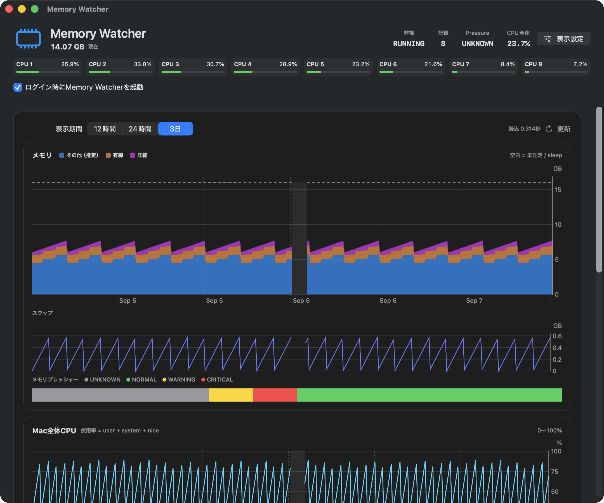

# Memory Watcher

Memory Watcherは、Mac全体のメモリとCPUを5秒ごとに記録し、あとから
12時間・24時間・3日の履歴を確認できる軽量なmacOSメニューバーアプリです。
測定データはMac内のSQLiteにだけ保存し、外部へ送信しません。

最新ソースはv0.3.3です。v0.3.3の配布アプリはDeveloper IDで署名され、
Appleの公証とGatekeeper評価を通過しています。

> **最新Release:** [Memory Watcher v0.3.3](https://github.com/Oneroad-jpg/memory_watcher/releases/tag/v0.3.3)
> を公開しています。配布ZIPはDeveloper ID署名、Apple公証、Gatekeeper評価、
> 公開後の再ダウンロード検証を通過しています。

Office OneRoadが目的、対象範囲、対象外、工程、完了条件、実機での評価を定め、
Codexがコード生成、テスト、Git操作を担当しました。開発管理と検証根拠は
[開発と検証](#開発と検証)から確認できます。



> v0.3.3の実アプリをダーク表示・8論理CPU構成で描画した画面です。
> 履歴部分には、表示確認用の決定的なデモデータを使用しています。

## 一目でわかる現在地

| 分類 | 状態 | かんたんな説明 |
|---|---|---|
| メモリとCPUの履歴 | ✅ 利用・実機確認済み | 5秒ごとに記録し、12時間・24時間・3日のグラフで確認できます |
| データの保存 | ✅ ローカルのみ | 測定値はこのMac内のSQLiteへ保存し、外部へ送信しません |
| 公開配布 | ✅ 公開・再確認済み | 署名・Apple公証済みのv0.3.3をGitHubから再取得して検証しました |
| Apple Silicon Mac | ✅ M2で長時間確認済み | 配布版はarm64用です。ほかのApple Silicon機種は同じ範囲の実機監査をしていません |
| Intel Mac | ⚠️ ビルドのみ確認 | ソースからのビルドは通過していますが、配布版とIntel実機試験はありません |
| GPU・アプリ別解析・AI診断 | ― 未実装 | Memory Watcherが推測した診断結果として表示することはありません |
| 完全な安全・無欠陥の保証 | ― 保証なし | 公開ソース、検証、署名、公証でリスクを下げていますが、バグがないことまでは保証しません |

できたこと、できていないこと、確認方法、安全性の意味と限界は
[透明性・信頼性・現在の限界](docs/Transparency_and_Trust.md)に、図と表でまとめています。

## 主な機能

- 物理メモリ、使用量、有線、圧縮、キャッシュ、スワップを記録
- Mac全体CPUと論理CPUごとの使用率を記録
- メモリプレッシャーを `UNKNOWN`・`NORMAL`・`WARNING`・`CRITICAL` で記録
- 12時間・24時間・3日の履歴グラフ
- スリープと測定欠落を補間せず、グラフ上の空白として表示
- 選択した時刻のメモリ・CPU実測値を大きな表で表示
- メニューバーから履歴ウインドウを開閉
- ログイン時起動を利用者が選択可能
- 表示密度、セクション順、表示項目をアプリ内で調整可能

## ダウンロードとインストール

公開された配布物は
[GitHub Releases](https://github.com/Oneroad-jpg/memory_watcher/releases)
で確認できます。新規導入には、署名・公証済みの
[MemoryWatcher-0.3.3.zip](https://github.com/Oneroad-jpg/memory_watcher/releases/download/v0.3.3/MemoryWatcher-0.3.3.zip)
を使用してください。v0.3.2は未公証の旧版として残していますが、新規導入には
推奨しません。

次の手順で導入できます。

1. Releaseから `MemoryWatcher-<version>.zip` をダウンロードする
2. ZIPを展開する
3. 展開した `.app` を `Applications` フォルダへ移動する
4. アプリを開き、メニューバーのMemory Watcherアイコンから履歴を表示する
5. 必要なら「ログイン時にMemory Watcherを起動」を有効にする

v0.3.3の正規配布物は、macOSのセキュリティ警告を回避する操作を必要としません。
署名または開発元を検証できないという警告が出た場合は無理に開かず、Releaseの
バージョンと配布元を確認してください。

更新時はMemory Watcherを終了してから新しい `.app` へ置き換えてください。
アプリを置き換えても、既存のSQLite履歴と表示設定は利用者のライブラリ内に残ります。
自動更新機能はありません。

### v0.3.3配布物の照合値

```sh
shasum -a 256 MemoryWatcher-0.3.3.zip
```

期待するSHA-256:

```text
861079b48b6d7c2ba6d5424683917b375044824d3f5d88a22acc7aeae692844c
```

この値は署名・公証・ZIP展開後検証を通過した候補、工程24記録、GitHubへ公開後に
再ダウンロードしたZIPで一致しています。利用時は、実際にダウンロードしたZIPの
値と比較してください。
公開時の変更内容と検証範囲は
[v0.3.3 Release Notes](docs/Release_Notes_v0.3.3.md)にもまとめています。

## 対応Macと検証範囲

| 対象 | 対応範囲 | 現在の検証状態 |
|---|---|---|
| v0.3.3配布アプリ | macOS 14以降、Apple Silicon（arm64） | M2・16 GB Macで署名、公証、インストール、実記録を確認。GitHub Releaseで公開済み |
| ソースからのビルド | macOS 14以降、Apple SiliconおよびIntel（x86_64） | Intel向けビルドは確認済み。Intel実機での動作は未検証 |
| CPU構成 | 論理CPU数を実行時に取得 | 1・8・16・32論理CPUのテストデータで確認 |

配布アプリは特定のMac、Apple Account、端末ID、ライセンスキーには固定されて
いません。ほかのApple Silicon Macにもインストールできる設計です。メモリ容量と
論理CPU数は起動したMacから動的に取得します。

ただし、実機での長時間運転確認はM2 Macが中心です。ほかのApple Silicon機種と
Intel Macについて、同じ範囲の実機監査が完了したとは扱いません。v0.3.3の
配布ZIPはUniversal Binaryではなく、Apple Silicon専用です。

履歴はMacごとに独立します。別のMacへの履歴同期、移行、自動統合は行いません。

## 使い方

1. Memory Watcherを起動する
2. メニューバーのアイコンから「履歴を開く」を選ぶ
3. `12時間`・`24時間`・`3日`を切り替える
4. グラフ上の時刻を選び、メモリとCPUの詳細表を確認する
5. 表示を調整するときは「表示設定」またはCommand-commaを開く

起動直後、CPU差分の初回測定、スリープ復帰直後など、値を確定できない区間は
`UNKNOWN`または空白になります。値を推測して埋めることはありません。

### 表示構成エディタ

表示構成エディタはウェブサイト用CMSではなく、Memory Watcherの画面だけを
調整するローカル機能です。

- 表示密度を `compact`・`balanced`・`detailed` から選択
- メモリ履歴、Mac全体CPU、論理CPU別履歴、選択時刻詳細の順序を変更
- 論理CPU別履歴と選択時刻詳細を表示・非表示
- 「標準に戻す」で標準配置へ復元

設定はmacOSのUserDefaultsへ保存されます。測定周期、SQLite履歴、保持期間、
通信設定は変更しません。自由な座標配置、テーマ作成、プラグイン追加、測定項目の
変更を行うデザインツールではありません。

## 記録内容

メモリ履歴には、物理メモリ、使用量（推定）、その他の使用量（推定）、有線、
圧縮、キャッシュ（推定）、スワップを保存します。CPU履歴にはMac全体と各論理CPUの
user・system・nice・idleカウンター差分から求めた使用率を保存します。

Memory WatcherはActivity Monitorと同じ傾向をあとから確認することを目的とします。
取得時刻、丸め、公開API、表示上の定義が異なるため、Activity Monitorの各数値や
連続的なメモリプレッシャー曲線との完全一致は保証しません。推定値には画面上で
「推定」と表示します。

## データ保存とプライバシー

測定履歴は次のローカルSQLiteに保存します。

```text
~/Library/Application Support/MemoryWatcher/memory-watcher.sqlite3
```

12時間・24時間表示には生の測定値、3日表示には1分集約値を使用します。
保存期限を超えた記録は、集約成功後に自動整理されます。スリープ中には偽の
測定値を生成しません。

Memory Watcherは次の処理を行いません。

- 外向き通信、分析送信、クラウド同期
- 通知
- プロセス別・アプリ別の解析
- 閲覧履歴、ファイル内容、入力内容の収集

アプリを削除してもSQLite履歴は自動削除されません。履歴も削除する場合は、
Memory Watcherを終了したうえで上記の `MemoryWatcher` フォルダを利用者自身で
削除してください。

## 現在の対象外

- GPU使用率の記録
- プロセス別・アプリ別のメモリ／CPU解析
- iPhone・iPadでのバックグラウンド監視
- 通知、異常検知、クラウド保存
- AIによる診断
- Activity Monitorの完全な複製
- 自動更新

## ライセンス

Memory Watcherは[MIT License](LICENSE)で公開します。
Copyright (c) 2026 Office OneRoad.

商用利用、個人利用、改変、再配布が可能です。ソフトウェアのコピーまたは
重要な部分には、著作権表示とMIT Licenseの許諾表示を含めてください。
本ソフトウェアは無保証で提供されます。

## ソースからビルドする

必要な環境はmacOS 14以降、Xcode 26系、Swift 6系です。

```sh
git clone https://github.com/Oneroad-jpg/memory_watcher.git
cd memory_watcher
swift build
swift test
scripts/build-development-app.sh
open .build/MemoryWatcher.app
```

外部パッケージには依存しません。Apple SDKとmacOS同梱SQLiteだけを使用します。

### メンテナー向け署名・公証

Mac App Store外の正式配布物は、Developer ID、Hardened Runtime、安全な
タイムスタンプ、Appleの公証チケットを使用します。

```sh
MEMORY_WATCHER_SIGNING_IDENTITY="Developer ID Application: Your Name (TEAMID)" \
  scripts/build-release-app.sh 0.3.3 1
MEMORY_WATCHER_NOTARY_PROFILE="MemoryWatcher-Notarization" \
  MEMORY_WATCHER_NOTARY_KEYCHAIN="/path/to/login.keychain-db" \
  scripts/notarize-release-app.sh 0.3.3
```

Apple Account、アプリ用パスワード、APIキー、公証ログ、submission IDを
ソース、Git履歴、配布ZIPへ保存しないでください。公証完了は `Accepted`、
`stapler validate`、`spctl --assess`がすべて成功した場合に限ります。

## 開発と検証

本プロジェクトは、利用者がコードを直接記述せず、Codexとの対話で目的、制約、
工程、完了条件を定めて開発した「ノーコード開発のための習作」でもあります。
生成物はSwiftとSwiftUIで実装された通常のネイティブmacOSアプリです。

人が担ったのは、解決したい問題の定義、機能と対象外の選択、測定・保持・表示要件、
工程の順序と完了条件、Activity Monitorとの照合、実機での採否判断です。Codexは
その条件に基づく実装、テスト、文書化、Git上の変更作成を担当しました。

| バージョン | 主な到達点 |
|---|---|
| v0.1 | メモリ測定、SQLite、履歴、メニューバー、24時間監査 |
| v0.2 | Mac全体CPU、論理CPU別履歴、単一ダッシュボード |
| v0.3 | 表示プリセットとアプリ内表示構成エディタ |
| v0.3.1 | 上部余白削減と論理CPU一覧 |
| v0.3.2 | 選択時刻詳細の表形式化 |
| v0.3.3 | Developer ID署名、Apple公証、安全な更新経路 |

実装前に対象と対象外を固定し、各工程に観測可能な完了条件を置いています。
実測、SQLite読戻し、OS標準表示との照合、回帰試験を分離し、説明不能な差や
incidentがあればその工程で停止します。

主な設計・検証記録:

- [v0.1確定要件](docs/Memory_Watcher_v0.1_Requirements.md)
- [v0.1実装工程表](docs/Memory_Watcher_v0.1_Final_Implementation_Plan.md)
- [メモリ指標定義](docs/Memory_Metric_Definitions_v1.md)
- [CPU指標定義](docs/CPU_Metric_Definitions_v1.md)
- [v0.2 CPU・統合画面工程表](docs/Memory_Watcher_v0.2_CPU_and_Unified_Dashboard_Plan.md)
- [表示設定契約](docs/Dashboard_Layout_Contract_v1.md)
- [v0.3.3署名・公証工程表](docs/Memory_Watcher_v0.3.3_Developer_ID_Notarization_Plan.md)
- [工程24署名・公証検証](docs/Phase_24_Verification.md)

各工程の詳細は[docs](docs/)に保存しています。v0.3.3では全134テスト、
Release build、署名、公証、ZIP展開後検証、インストール後のSQLite実記録読戻しが
完了しています。GitHub Releaseへのv0.3.3 ZIP公開と公開後の再ダウンロード検証も
完了しています。Intel実機とUniversal Binary配布は未完了です。
