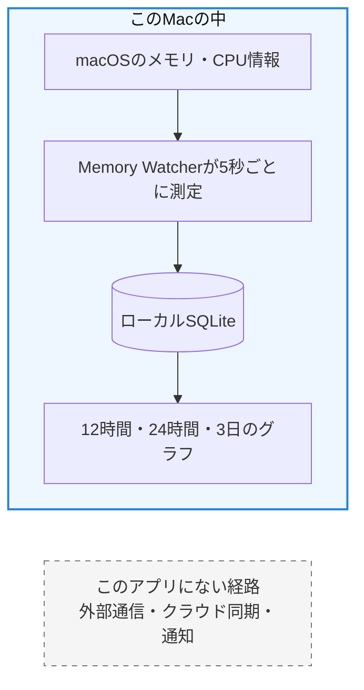
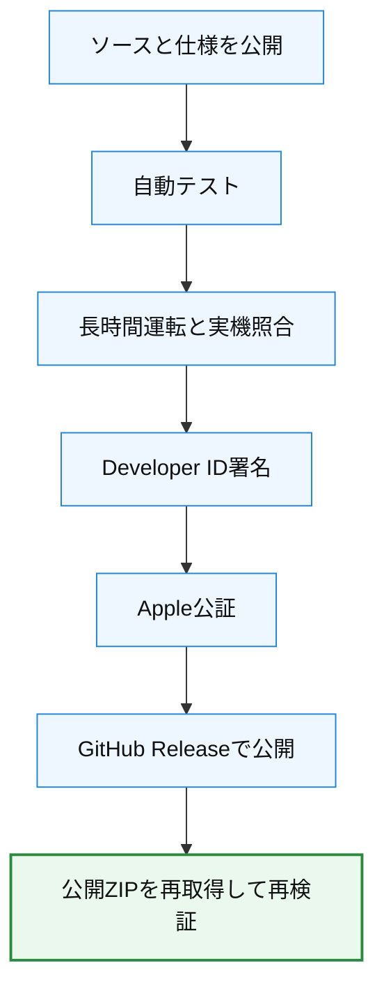

# Memory Watcherの透明性・信頼性・現在の限界

この文書は、Memory Watcher v0.3.3について「何ができるのか」「何を確認したのか」
「まだ何ができていないのか」を、専門知識がなくても判断できるようにまとめたものです。

## 30秒で分かる結論

- Mac全体のメモリとCPUを、アプリ起動中に5秒ごとに記録できます。
- 履歴はこのMac内だけに保存され、外部送信、クラウド同期、通知は行いません。
- 公開版はApple Silicon用です。M2 Macで長時間運転を確認しています。
- Developer ID署名とApple公証を通過し、公開ZIPを再ダウンロードして検証しています。
- GPU、アプリ別解析、AI診断、Intel用配布版、自動更新はありません。
- 署名や公証を含む検証はリスクを下げますが、完全な安全や無欠陥を保証するものではありません。

## 状態表示の意味

| 表示 | 意味 |
|---|---|
| ✅ 利用・確認済み | v0.3.3で利用でき、対応する試験または実機確認があります |
| ⚠️ 一部確認 | 設計またはビルドは対応していますが、同じ範囲の実機確認はありません |
| ◇ 計画済み | 工程表はありますが、現在の公開版にはまだ実装されていません |
| ― 未実装 | 現在のアプリにはその機能がありません |
| ⓘ 保証対象外 | 意図した機能ではないか、完全性を証明できない項目です |

## できること

| できること | 状態 | 利用者にとっての意味 |
|---|---|---|
| Mac全体のメモリ記録 | ✅ | 使用量、有線、圧縮、キャッシュ、スワップなどを記録します |
| Mac全体のCPU記録 | ✅ | Mac全体のCPU使用率の変化を確認できます |
| 論理CPUごとの記録 | ✅ | 各論理CPUの使用率を個別に確認できます |
| 12時間・24時間・3日の履歴 | ✅ | 一時的な値だけでなく、時間による変化を振り返れます |
| スリープと欠測の区別 | ✅ | 測れなかった時間を推測値で埋めず、グラフの空白として扱います |
| メニューバー常駐 | ✅ | ウインドウを閉じても、アプリを終了しない限り記録を続けます |
| ログイン時起動 | ✅ | 利用者が設定した場合だけ、ログイン時に起動します |
| 表示構成の調整 | ✅ | 表示密度、セクション順、一部項目の表示・非表示を変更できます |
| ローカル保存 | ✅ | 測定値と表示設定は、それぞれこのMac内に保存します |
| 公開版の直接ダウンロード | ✅ | GitHub Releaseから署名・公証済みZIPを取得できます |

Macがスリープしている間や、アプリが終了している間は測定できません。その時間を
測定済みであるように補間しないことも、Memory Watcherの設計の一部です。

## データはどこへ行くのか



Memory Watcherは、閲覧履歴、ファイル内容、キーボード入力、プロセス別・アプリ別の
利用状況を収集しません。測定履歴は
`~/Library/Application Support/MemoryWatcher/memory-watcher.sqlite3`に保存します。

## 現在できていないこと

| できていないこと | 状態 | 補足 |
|---|---|---|
| GPU使用率の記録 | ― 未実装 | v0.3.3では測定しません |
| アプリ別・プロセス別の解析 | ― 未実装 | どのアプリが原因かを特定する機能はありません |
| AIによる診断 | ― 未実装 | 原因や将来の状態をAIで推測しません |
| 通知と異常検知 | ― 未実装 | 警告通知を送る機能はありません |
| クラウド同期と複数Mac統合 | ― 未実装 | 履歴はMacごとに独立します |
| iPhone・iPadの継続監視 | ― 未実装 | macOS専用です |
| 自動更新 | ― 未実装 | 更新時は新しいアプリへ手動で置き換えます |
| スクロール不要の全体表示 | ◇ 計画済み | [v0.3.4の独立工程](Memory_Watcher_v0.3.4_No_Scroll_Dashboard_Plan.md)として計画し、現在は未実装です |
| Intel Mac用の配布版 | ― 未実装 | Intel向けビルドは確認していますが、v0.3.3 ZIPはarm64専用です |
| Activity Monitorの完全な複製 | ⓘ 保証対象外 | 公開API、取得時刻、丸め、定義の違いがあります |
| 将来のmacOSでの動作 | ⓘ 保証対象外 | OS変更後は改めて確認が必要です |

## 何を実際に確認したのか

「実装した」という主張と「実際に確認した」という主張を分けています。

| 確認項目 | 結果 | 確認範囲と限界 |
|---|---|---|
| 統合版の24時間実運転 | ✅ PASS | M2 Macで86,681秒、17,279件の測定値を記録しました |
| 説明不能な測定欠落 | ✅ 0件 | 上記24時間監査で確認しました |
| スリープ・復帰 | ✅ PASS | スリープ中sample 0、復帰後の記録再開を確認しました |
| Activity Monitorとの比較 | ✅ PASS | 3時点で比較し、説明不能な差は0件でした。完全一致の保証ではありません |
| アプリの軽さ | ✅ 目標内 | 24時間監査版の平均CPU 0.901%。常駐メモリの単調増加はありませんでした |
| 外部接続 | ✅ 観測0 | 長時間監査中のInternet socket 0、製品ソースの通信API検出0でした |
| データベース | ✅ 正常 | SQLite `integrity_check=ok`、予測保持容量は設定上限内でした |
| v0.3.3回帰試験 | ✅ 134/134 PASS | Release buildと配布工程の試験を含みます |
| v0.3.3の署名・公証 | ✅ PASS | Developer ID、Hardened Runtime、Apple公証、Gatekeeperを確認しました |
| 公開ZIPの読戻し | ✅ PASS | GitHubから再取得し、SHA-256、ZIP、署名、公証、version、arm64を再確認しました |
| v0.3.3そのものの24時間再監査 | ⚠️ 未実施 | 測定機能を統合した版で24時間監査済みですが、最終配布ZIPで同じ監査を繰り返してはいません |
| ほかのApple Silicon実機 | ⚠️ 未実施 | 動的なメモリ・CPU取得設計ですが、M2と同じ長時間監査は未実施です |
| Intel実機 | ⚠️ 未実施 | x86_64 Release buildまで確認し、実機動作は未確認です |
| 独立した第三者監査 | ⚠️ 未実施 | 公開ソースを第三者が確認できますが、外部機関の監査は受けていません |
| 再現可能ビルド | ⚠️ 未確認 | 公開ZIPの同一性はSHA-256で確認できますが、ソースから同一バイトを再現する保証はありません |

詳しい数値と条件は、[工程11の軽量性・非通信検証](Phase_11_Verification.md)、
[工程17の統合版最終監査](Phase_17_Verification.md)、
[工程24の署名・公証検証](Phase_24_Verification.md)に保存しています。

## 公開版へ至る確認の流れ



この流れは、公開物の取り違え、未検証版の配布、既知の問題を見落とす可能性を
小さくするためのものです。ただし、すべての不具合や未知の攻撃を防ぐ証明では
ありません。

## 「署名」「公証」「SHA-256」が意味すること

| 項目 | 確認できること | 確認できないこと |
|---|---|---|
| Developer ID署名 | 配布後にアプリが改変されていないか、署名者をmacOSが確認できます | バグがないこと、すべての動作が正しいこと |
| Apple公証 | Appleの公証手続きを通過し、公証チケットが添付されていること | Appleが機能や測定値を保証したという意味ではありません |
| Gatekeeper | macOSが公証済みDeveloper IDアプリとして受け入れること | 将来を含む完全な安全性 |
| SHA-256 | 手元のZIPが公開時に確認したZIPと同じバイトか比較できます | ソースから同一バイトを再現できること |
| 公開ソース | 実装と変更履歴を第三者が確認できます | 誰かがすべてのコードを監査済みであること |

## 利用者が自分で確認する方法

通常は[Memory Watcher v0.3.3 Release](https://github.com/Oneroad-jpg/memory_watcher/releases/tag/v0.3.3)
からダウンロードすれば十分です。より厳密に確認したい場合は、Terminalで次を実行できます。

```sh
shasum -a 256 MemoryWatcher-0.3.3.zip
```

表示された値が次と一致することを確認します。

```text
861079b48b6d7c2ba6d5424683917b375044824d3f5d88a22acc7aeae692844c
```

一致しない場合や、macOSが署名者を確認できないと表示した場合は、無理に開かず、
ダウンロード元とRelease versionを確認してください。

## 検証文書の読み方

工程別の検証文書は、工程の実装commitやPull Requestを作る直前の状態を保存している
場合があります。そのため、文書末尾にある「commit・PR・merge」の欄が未チェックでも、
後続のGit履歴で完了している場合があります。チェックを後から書き換えて歴史を整える
のではなく、当時の観測記録と、その後の公開Git履歴を分けて残しています。

現在の公開状態は`main`、[Pull Requests](https://github.com/Oneroad-jpg/memory_watcher/pulls?q=is%3Apr+is%3Aclosed)、
[Releases](https://github.com/Oneroad-jpg/memory_watcher/releases)を合わせて確認できます。

## 問題を見つけたとき

不具合、表示の不一致、説明が分かりにくい箇所を見つけた場合は、
[GitHub Issues](https://github.com/Oneroad-jpg/memory_watcher/issues)へ、macOS version、
Macの種類、Memory Watcher version、再現手順を記載してください。履歴SQLite、認証情報、
個人情報を公開で添付する必要はありません。

## 現在の信頼性をどう表現するか

Memory Watcherは、公開ソース、工程別の完了条件、実機監査、署名・公証、公開ZIPの
読戻し、および未検証範囲の明示によって、個人開発の公開macOSアプリとして合理的に
確認可能な信頼性を備えています。

これは「完全に安全」「すべてのMacで検証済み」「不具合がない」という宣言では
ありません。確認できた事実と、まだ確認できていない範囲を分けて公開することを、
このプロジェクトの透明性と説明責任としています。
